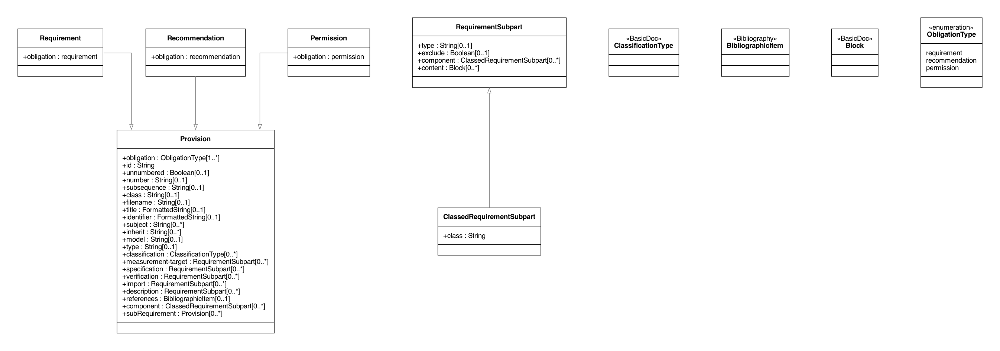
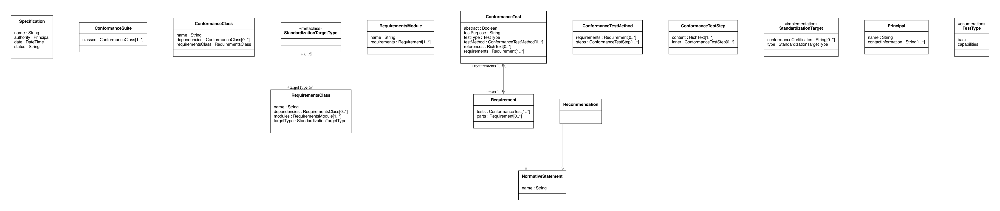

= Metanorma Requirements Models

image:https://github.com/metanorma/metanorma-requirements-models/workflows/make/badge.svg["Build Status", link="https://github.com/metanorma/metanorma-requirements-models/actions?query=workflow%3Amake"]

https://www.metanorma.org[Metanorma] supplies a predefined set of information
models for the encoding of machine-readable requirements.

== Scope

This repository provides the definitions of requirement models supported by
Metanorma.

These models are used for:

* Encoding machine-readable requirements in Metanorma standards
* Reference for Metanorma users who wish to understand these models when used in
  Metanorma syntax
* Export of machine-readable requirements

Metanorma supports usage of the following requirement models:

. Metanorma requirement models
. OGC modular specification models (OGC ModSpec)

== Modelling

=== General

A standard or specification generally contains a set of requirements that apply
to a subject. The value of a machine-readable or machine-interpretable
requirement is the ability to allow a machine to perform validation (or commonly
called, a "test") of that requirement to determine compliance.

These models (a "requirement models suite") commonly include the following:

* a "requirement" model
* a "conformance test" model
* a collection specification mechanism such as:
** "requirements class" which describes the common motivation of a set of
  requirements
** "conformance test class" that describes the common motivation, or a set of
  coherent features, amongst a set of tests

Various suites support slightly different primitives and have slightly different
semantics.

[example]
The OGC ModSpec supports requirement parts, test parts and hierarchical test
steps.

[example]
The Metanorma requirement models support encoding of machine-executable code
within a requirement.

.Metanorma requirement models in UML

.OGC ModSpec models in UML

=== Metanorma requirement models

include::views/requirements.lutaml[]

=== OGC ModSpec models

include::views/ogc-modspec.lutaml[]

=== Examples

==== Metanorma requirements examples

Encoding examples of Metanorma requirements models are available at
https://github.com/metanorma/metanorma-mrr-samples[metanorma-mrr-samples].

====
[source,xml]
----
<recommendation id="_">
  <label>/ogc/recommendation/wfs/2</label>
  <inherit>/ss/584/2015/level/1</inherit>
  <subject>user</subject>
  <description>
    
I recommend <em>this</em>.

  </description>
  <specification exclude="false" type="tabular">
    
This is the object of the recommendation:

    <table id="_">
      <tbody>
        <tr>
          <td align="left">Object</td>
          <td align="left">Value</td>
        </tr>
        <tr>
          <td align="left">Mission</td>
          <td align="left">Accomplished</td>
        </tr>
      </tbody>
    </table>
  </specification>
  <description>
    
As for the measurement targets,

  </description>
  <measurement-target exclude="false">
    
The measurement target shall be measured as:

    <formula id="_">
      <stem type="AsciiMath">r/1 = 0</stem>
    </formula>
  </measurement-target>
  <verification exclude="false">
    
The following code will be run for verification:

    <sourcecode id="_">CoreRoot(success): HttpResponse
      if (success)
      recommendation(label: success-response)
      end
    </sourcecode>
  </verification>
  <import exclude="true">
    <sourcecode id="_">success-response()</sourcecode>
  </import>
</recommendation>
----
====

